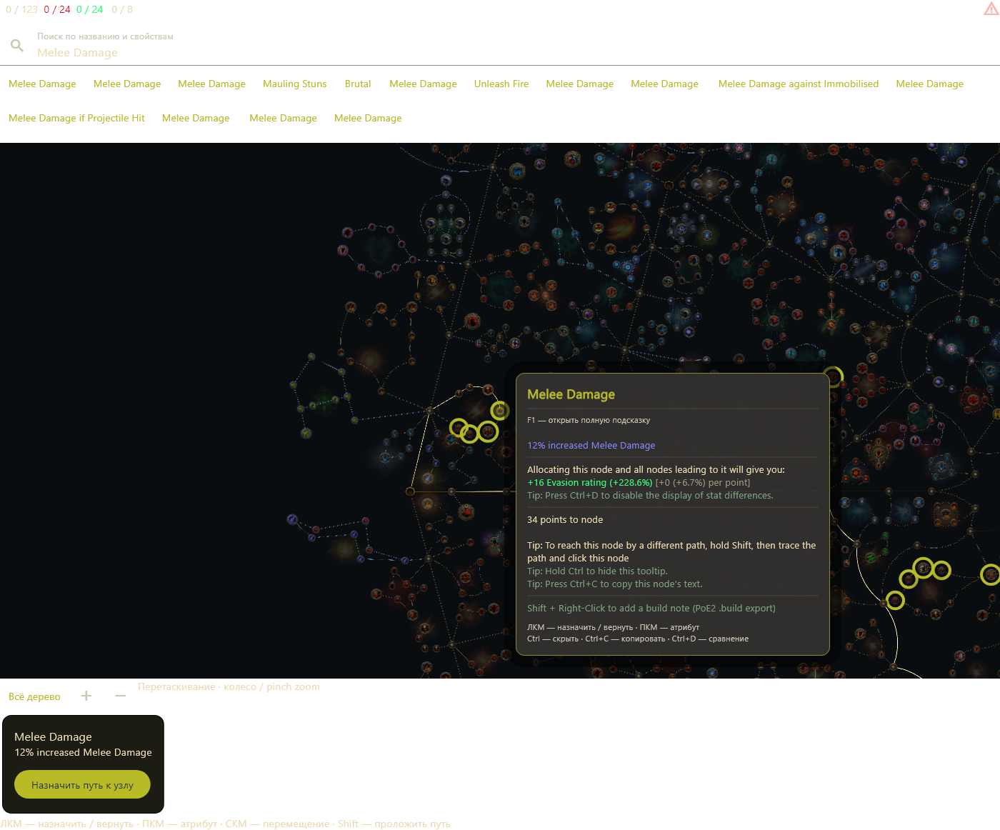

# Flutter · Мастерская Path of Building

Первая рабочая Windows-основа, Flutter 3.47.5 / Dart 3.13.4. Это разработческое приложение, не готовая автономная поставка.

Из `app/`:

- `flutter pub get` — зависимости стандартного шаблона Flutter.
- `flutter run -d windows` — запуск из репозитория.
- `flutter analyze` — статическая проверка.
- `flutter test` — настоящий процесс Lua: загрузка XML, удвоение DPS, отклонение устаревшей ревизии и экспорт.
- `flutter build windows --debug` — сборка Windows.

Клиент использует Python из PATH и адаптер `app/tools/` и исходные `runtime/`, `src/` родительского репозитория. Не переносите один exe отдельно: runtime и загрузчик ещё не упакованы. Первая версия только Windows; мобильный адаптер и web не реализованы.

Работают: Gruvbox Dark/Light, компактная и широкая навигация, загрузка эталона Fireball, ввод модификаторов PoB, настоящие показатели Lua, вставка XML и получение XML для ручного сохранения. Добавлены открытие/сохранение по полному пути, резервная копия .bak, undo/redo модификаторов через XML и автосохранение последней сборки в LOCALAPPDATA/PathOfBuildingWorkshop/session.xml. Восстановление вызывается кнопкой в шапке. Нативный файловый диалог, предметы и остальные разделы пока отсутствуют. Поле XML экспортирует текст, но не записывает файл автоматически.

Зависимости получены командой `flutter pub get` из стандартного реестра pub.dev; версии фиксируются в `pubspec.lock`. Источники: https://docs.flutter.dev/ и https://pub.dev/packages/flutter_lints . Новых библиотек состояния или нативных интеграций не добавлено.

Сессия сохраняет только применённое состояние движка. Неприменённый текст полей, тема и история отмены после перезапуска не восстанавливаются. Открытие другой сборки очищает историю. При ошибке записи расчёт остаётся применённым, а ошибка отображается пользователю. Поле модификаторов после undo/redo очищается; значение сохраняется внутри XML, но обратное заполнение редактора ещё не подключено.

Раздел «Дерево» отображает реальные координаты и связи Lua с игровыми текстурами версии 0_5. Поддержаны поиск по названию/свойствам, переход к результату, pan/zoom, общий вид, выбор узла перед назначением, назначение пути и возврат с пересчётом. Счётчики очков и предупреждения берутся из Lua; настройки доступны кнопкой справа над картой.

Игровые PNG получены из исходных DDS-массивов командой `python app/tools/export_flutter_tree_art.py`; требуется `python -m pip install Pillow==12.3.0 zstandard==0.25.0`. Источники: https://pillow.readthedocs.io/ и https://python-zstandard.readthedocs.io/ . Фоны уменьшены до 768 px; графика принадлежит исходным правообладателям и поставляется с теми же ограничениями, что ресурсы проекта. Поддержаны иконки, рамки и фоны классов/восхождений. Отрисовка основана на PassiveTreeView.lua и PassiveTree.lua: исходные размеры узлов и рамок, геометрия прямых и дуг, декоративные группы, центральная рамка класса и эффекты. Экспортировано 902 текстуры. Добавлены подсказки из оригинального AddNodeTooltip с настоящими изменениями расчётов, предпросмотр пути и возврата зависимых узлов, выбор атрибутов, оружейные режимы, заметки, самоцветы, управление наборами и их сравнение. Полная проверка редких механик и других версий дерева ещё не завершена.

## Управление деревом

- ЛКМ назначает путь или возвращает узел. На сенсорном экране касание выбирает узел, отдельная кнопка подтверждает действие.
- ПКМ переключает атрибут; на назначенном гнезде открывает самоцветы. Доступны предметы сборки и вставка текста из игры.
- Удерживайте 2 / S, 3 / D, 1 / I для силы, ловкости и интеллекта. Без клавиши новый узел атрибута открывает диалог.
- Перетаскивание ЛКМ, СКМ и ПКМ по свободному месту перемещает карту; колесо и pinch меняют масштаб.
- Shift прокладывает собственный путь от назначенного узла; Shift+ПКМ редактирует заметку.
- Ctrl скрывает подсказку, Ctrl+D переключает расчётные изменения, Ctrl+C копирует название и свойства, F1 открывает полную подсказку. Длительное касание открывает её на сенсорном экране.
- Ctrl+F фокусирует поиск; Ctrl+Z / Ctrl+Y и боковые кнопки мыши отменяют и повторяют действия. Стрелки влево/вправо переключают оружейный режим.

Камера использует переход 240 мс, подсказка и подсветка — 160 мс, отклик назначения — 450 мс. Системное отключение анимаций учитывается. Поиск узла использует пространственные ячейки; анимации подсказки и маркеров отделены от рисования карты. Частота кадров на минимальном целевом устройстве ещё не измерена.

Ниже — проверочный снимок Flutter с реальным деревом и подсказкой Lua:

## Граница переноса

Все дополнения находятся в `app/`, включая `prototype/`, `tools/`, `docs/flutter/` и `TODO.md`. Файлы вне `app/` сверены с исходной ревизией `bb52d6b36`: `git diff bb52d6b36 -- . ":!app"` должен быть пустым. Это исходная ревизия форка, а не автоматически обновляемая последняя версия upstream.

Flutter отвечает за размещение элементов, отрисовку, анимацию, ввод и хранение сессии. Расчёт показателей, путей, выделения узлов, атрибутов, предметов и содержимого подсказок выполняется исходными классами Lua через адаптер. Показатели отсутствующей сборки отображаются как `—`. Редакторы остальных разделов пока не перенесены полностью.
